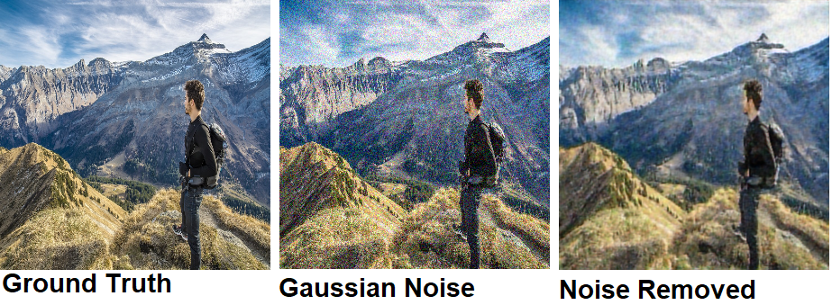
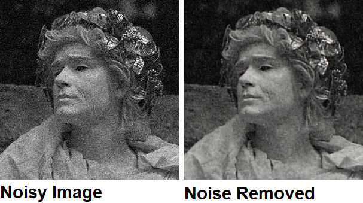

# Noise-Reduction-Tool

### [Website Link](http://noisy.pythonanywhere.com/)

I made this project while learning about neural networks. I used a functional neural network to try to remove gaussian noise from images.

### Model used:

### Examples:

From dataset:

From google:

Dataset: https://www.kaggle.com/duttadebadri/image-classification

Images from the travel and adventure folder were only trained and tested on

### TODOS:
  - Improve website design
  - Improve model
  - Find larger dataset
